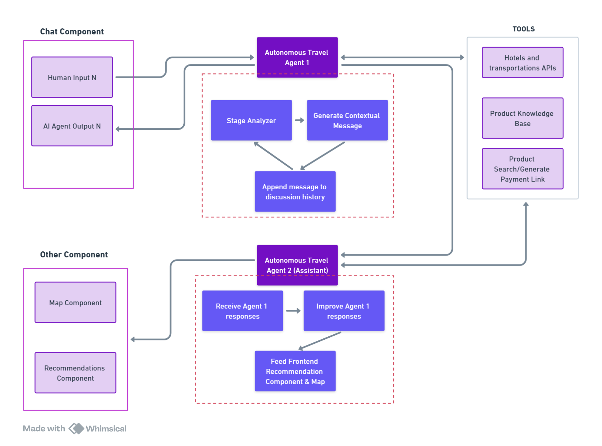
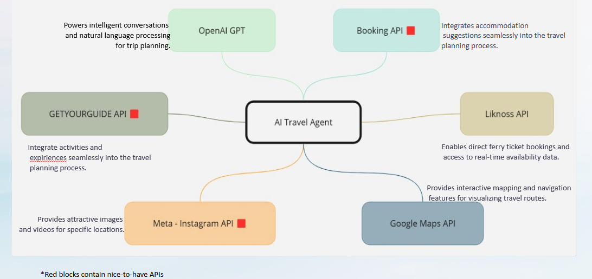

# AI Travel Agent

**Revolutionizing Trip Planning & Ticket Sales**

## Overview

The AI Travel Agent project is a cutting-edge application built on the foundation of SalesGPT, tailored to automate and simplify the trip-planning experience. By integrating advanced AI capabilities with industry-leading APIs, this project provides users with a seamless, personalized travel planning solution.

### The Problem

Planning a trip often requires navigating multiple websites, managing fluctuating prices, and spending significant time and effort. This iterative process can lead to frustration and missed opportunities.

### The Solution

AI Travel Agent consolidates the entire trip-planning process into one intuitive platform. It leverages AI to offer personalized recommendations for accommodations, transportation, and activities, making trip planning fast, efficient, and enjoyable.

---

## Features

- **Personalized Trip Planning**: Custom itineraries tailored to user preferences.
- **Integrated Recommendations**: Suggestions powered by Booking.com, Liknoss, and more.
- **Dynamic Interactions**: Real-time updates and adjustments based on user input.
- **Interactive Maps**: Visualize destinations and travel routes.
- **Automated Ferry Ticketing**: Streamlined booking with deals and discounts.

---

## Core Technologies

- **[LangChain](https://github.com/hwchase17/langchain)**: Manages structured conversations with LLMs and multi-agent workflows.
- **React Frontend**: Delivers a responsive and engaging user interface.
- **Python Backend**: Handles API integrations and business logic.
- **LiteLLM**: Aggregates and optimizes the use of multiple LLM integrations.
- **Dockerized Deployment**: Ensures scalability and reliability.
- **Nginx Proxy Manager**: Secures traffic management.

---

## Architecture

### State Machine Design
The application operates on a state machine architecture that enables:
1. **Trip Purpose Understanding**: Determines travel goals through intelligent querying.
2. **Preference Gathering**: Collects detailed user input for personalized itineraries.
3. **Recommendation Generation**: Provides options for attractions, accommodations, and routes.
4. **Booking Automation**: Facilitates seamless ticket purchases and travel arrangements.

---

## Business Potential

- **White-Label Solutions**: Offer a customizable AI travel agent to B2B clients.
- **Standalone AI OTA**: Establish a dedicated AI-powered Online Travel Agency.
- **Cross-Selling Opportunities**: Enhance revenue with integrated services.

---

## APIs and Integrations

- **OpenAI GPT-4**: Powers conversational capabilities.
- **Booking.com API**: Provides accommodation suggestions.
- **Liknoss API**: Enables ferry ticketing and real-time availability.
- **Google Maps/OpenStreetMap APIs**: Interactive mapping and navigation.

---

## Cost Optimization Strategy

- Transitioning from GPT-4 to a locally hosted LLaMA model to reduce API costs.
- Leveraging open-source APIs to minimize third-party dependencies.

---

## Roadmap

1. **MVP Launch**: Deliver core functionalities, including trip planning and ticketing.
2. **Expansion**: Add features like loyalty programs and advanced customization.
3. **Future Phases**: Introduce new integrations and scale to international markets.

---

## Getting Started

### Prerequisites

- [Docker](https://www.docker.com/)
- [Python 3.12](https://www.python.org/downloads/release/python-3120/)
- API keys for Booking.com, Liknoss, and Google Maps.

### Installation

1. Clone the repository:
   ```bash
   git clone https://github.com/Ddimitrako/SalesGPT.git
   ```
2. Navigate to the project directory:
   ```bash
   cd SalesGPT
   ```
3. Build and start the Docker containers:
   ```bash
   docker-compose up --build
   ```
4. Access the application at `http://localhost:3000`.

---
## Images


---

## License

This project is licensed under the MIT License. See the [LICENSE](LICENSE) file for details.

---
